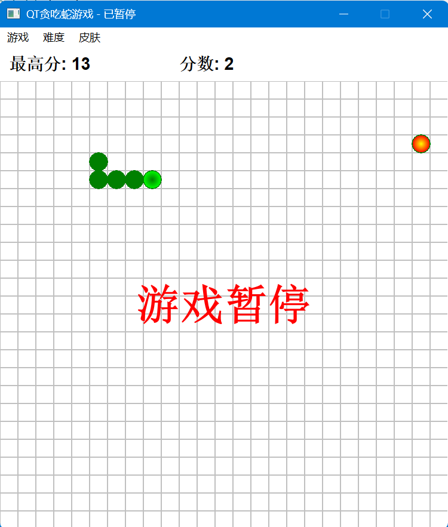

# QT贪吃蛇游戏（Snake Game with Qt）

本项目是一个基于 C++ 和 Qt Widgets 框架开发的桌面端贪吃蛇游戏，支持多种皮肤、难度调节、障碍物、音效、分数统计和游戏进度保存等丰富功能。适合 Qt/C++ 桌面开发学习、课程设计、兴趣娱乐等多种场景。

---

## 目录

- [项目简介](#项目简介)
- [功能特色](#功能特色)
- [演示截图](#演示截图)
- [环境要求](#环境要求)
- [快速开始](#快速开始)
- [详细操作说明](#详细操作说明)
- [主要文件结构与模块说明](#主要文件结构与模块说明)
- [核心设计与实现细节](#核心设计与实现细节)
- [常见问题与解决方案](#常见问题与解决方案)
- [贡献方式](#贡献方式)

---

## 项目简介

本项目实现了一个功能完善、界面美观的贪吃蛇游戏。采用面向对象设计，代码结构清晰，易于维护和扩展。支持多种皮肤风格、难度调节、障碍物模式、音效、分数统计、进度保存/读取等功能，用户体验良好。适合 Qt 桌面开发初学者和进阶者参考学习。

---

## 功能特色

- **经典贪吃蛇玩法**：键盘方向键控制蛇移动，吃食物变长，撞墙/撞自己/撞障碍物则游戏结束。
- **多种皮肤风格**：支持经典、暗黑、霓虹、自然等多种皮肤，菜单栏一键切换，界面风格即时生效。
- **难度调节**：支持简单、中等、困难三档速度，适合不同水平玩家。
- **障碍物模式**：可开启/关闭障碍物，障碍物随机生成，增加游戏挑战性。
- **音效支持**：吃食物、撞击等事件有音效提示，支持随时开关。
- **分数统计与最高分保存**：实时显示当前分数与历史最高分，自动保存到本地。
- **游戏进度保存/读取**：支持断点续玩，随时保存和恢复游戏进度。
- **菜单栏操作**：所有功能均可通过菜单栏便捷操作，贴合桌面应用习惯。
- **面向对象设计**：Snake、Food、ScoreManager、SoundManager、SkinManager 等核心模块解耦，便于维护和扩展。
- **跨平台支持**：支持 Windows、Linux、macOS。

---

## 演示截图

> 

> 
> 
> 
> *如需展示更多皮肤或功能，可添加多张截图。*

---

## 环境要求

- **操作系统**：Windows、Linux、macOS
- **Qt 版本**：Qt 5.15+ 或 Qt 6.x（推荐 Qt 6.5 及以上）
- **CMake**：3.16 及以上
- **C++ 编译器**：支持 C++17（如 MSVC、MinGW、Clang）

---

## 快速开始

### 1. 克隆仓库

```sh
git clone https://github.com/H1600/snake-qt.git
cd snake-qt
```

### 2. 使用 CMake 构建

```sh
mkdir build
cd build
cmake ..
cmake --build .
```

### 3. 运行游戏

- Windows 下可直接双击 `snake.exe`
- 其他平台在终端运行：
  ```sh
  ./snake
  ```

### 4. 使用 Qt Creator

- 直接用 Qt Creator 打开 `CMakeLists.txt`，选择合适的 Qt Kit，点击构建并运行。

---

## 详细操作说明

- **方向键（↑↓←→）**：控制蛇的移动方向
- **空格键**：暂停/继续游戏
- **R 键**：暂停时重开游戏
- **菜单栏功能**：
  - **皮肤切换**：经典、暗黑、霓虹、自然
  - **难度切换**：简单、中等、困难
  - **障碍物模式**：开启/关闭
  - **音效**：开启/关闭
  - **保存进度**：保存当前游戏状态
  - **读取进度**：恢复上次保存的游戏状态

- **游戏规则**：
  - 吃到食物蛇会变长，分数+1
  - 撞到墙、自己或障碍物游戏结束
  - 游戏结束后可选择重新开始或退出

---

## 主要文件结构与模块说明

| 文件/文件夹         | 说明                       |
|---------------------|----------------------------|
| main.cpp            | 程序入口                   |
| gamewindow.h/cpp    | 主窗口与游戏主逻辑         |
| snake.h/cpp         | 蛇对象及其行为             |
| food.h/cpp          | 食物对象及生成逻辑         |
| scoremanager.h/cpp  | 分数与进度管理             |
| soundmanager.h/cpp  | 音效管理                   |
| skinmanager.h/cpp   | 皮肤管理                   |
| resources.qrc       | Qt 资源文件（音效等）      |
| sounds/             | 音效文件目录               |
| CMakeLists.txt      | CMake 构建脚本             |
| README.md           | 项目说明文档               |

---

## 核心设计与实现细节

### 1. 面向对象模块划分

- **GameWindow**：主窗口，负责界面绘制、事件处理、菜单栏、游戏流程控制。
- **Snake**：蛇的身体、移动、增长、碰撞检测等逻辑。
- **Food**：食物的生成与位置管理，避免与蛇身和障碍物重叠。
- **ScoreManager**：分数统计、最高分保存、游戏进度保存/读取，基于 QSettings 实现本地持久化。
- **SoundManager**：音效播放与开关，基于 QSoundEffect 实现。
- **SkinManager**：皮肤风格切换与颜色管理，支持多种主题风格。

### 2. 主要技术点

- **QPainter**：自定义绘制游戏区域、蛇、食物、障碍物等，支持不同皮肤风格。
- **QTimer/事件循环**：驱动游戏主循环与刷新，定时移动蛇。
- **QSettings**：本地持久化分数和进度，支持断点续玩。
- **QSoundEffect**：多媒体音效播放，提升游戏体验。
- **信号槽机制**：菜单栏与功能模块解耦，响应用户操作。
- **资源管理**：通过 `.qrc` 文件管理音效等资源，跨平台无忧。

### 3. 皮肤与主题扩展

- 皮肤切换通过 `SkinManager` 管理，所有颜色参数集中管理，便于扩展新主题。
- 可自定义蛇身、蛇头、食物、背景、网格、障碍物等颜色。

### 4. 难度与障碍物

- 难度通过调整定时器间隔实现，速度越快难度越高。
- 障碍物随机生成，存储为 QPoint 列表，绘制时与皮肤风格联动。

### 5. 游戏进度保存与恢复

- 通过 `ScoreManager` 保存蛇身、食物位置、方向等信息，实现断点续玩。
- 支持多次保存和读取，方便玩家随时中断和恢复游戏。

---

## 常见问题与解决方案

**Q1：运行时报找不到 Qt 库？**  
A：请确保已正确安装 Qt，并配置好环境变量或在 Qt Creator 下运行。

**Q2：音效无法播放？**  
A：请确认 `sounds/` 目录下有 `eat.wav` 和 `crash.wav`，且已正确添加到 `resources.qrc`。

**Q3：皮肤切换无效？**  
A：请确保 `SkinManager` 的颜色接口被正确调用，并在切换皮肤后调用 `update()` 刷新界面。

**Q4：如何添加新皮肤或功能？**  
A：可在 `SkinManager` 中扩展皮肤类型，并在 `paintEvent` 中调用对应颜色接口。其它功能可参考现有模块扩展。

**Q5：构建失败或找不到头文件？**  
A：请检查 Qt 安装路径和 CMake 配置，确保 Qt Widgets、Qt Multimedia 模块已安装。

---

## 贡献方式

欢迎提交 issue、PR 或建议！  
如需贡献代码，请遵循以下流程：

1. Fork 本仓库
2. 新建分支进行开发
3. 提交 PR 并描述修改内容
4. 代码风格建议遵循 Qt 官方 C++ 编码规范

---

**感谢您的关注与支持，祝您游戏愉快
